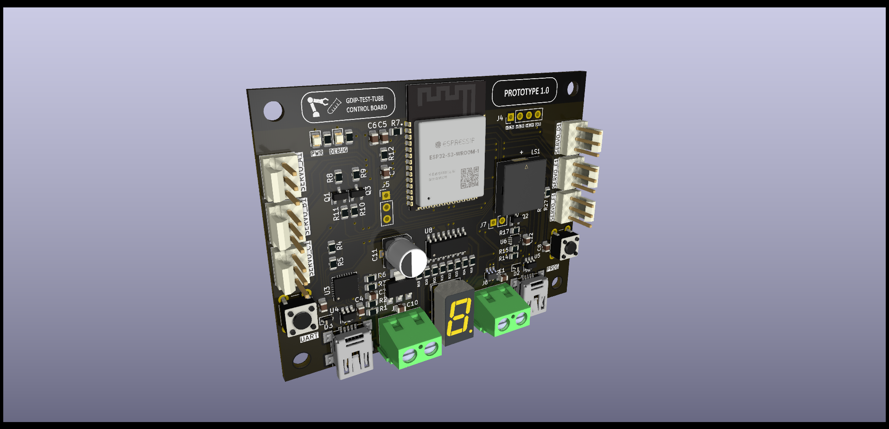

# GDIP Test Tube Hardware

Controller for AL5D Lynxmotion robotic arm.

## Features

- Webpage based more control using WiFi from the ESP32.
- Six servo outputs for control of all AL5D servos.
- Buzzer used to warn user that robotic arm is about to move.
- Seven segment display for error codes.
- Extra screw terminal for control of safety lightings around the arm.

